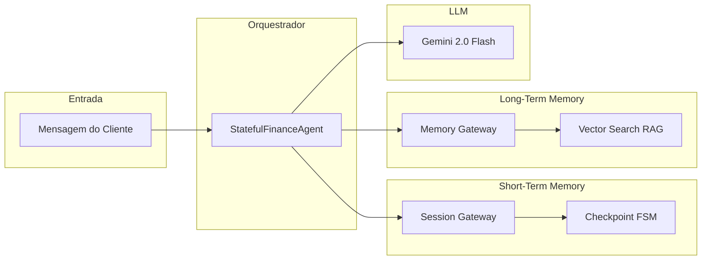
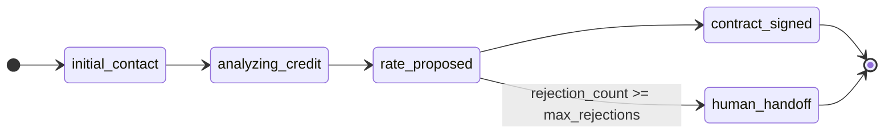
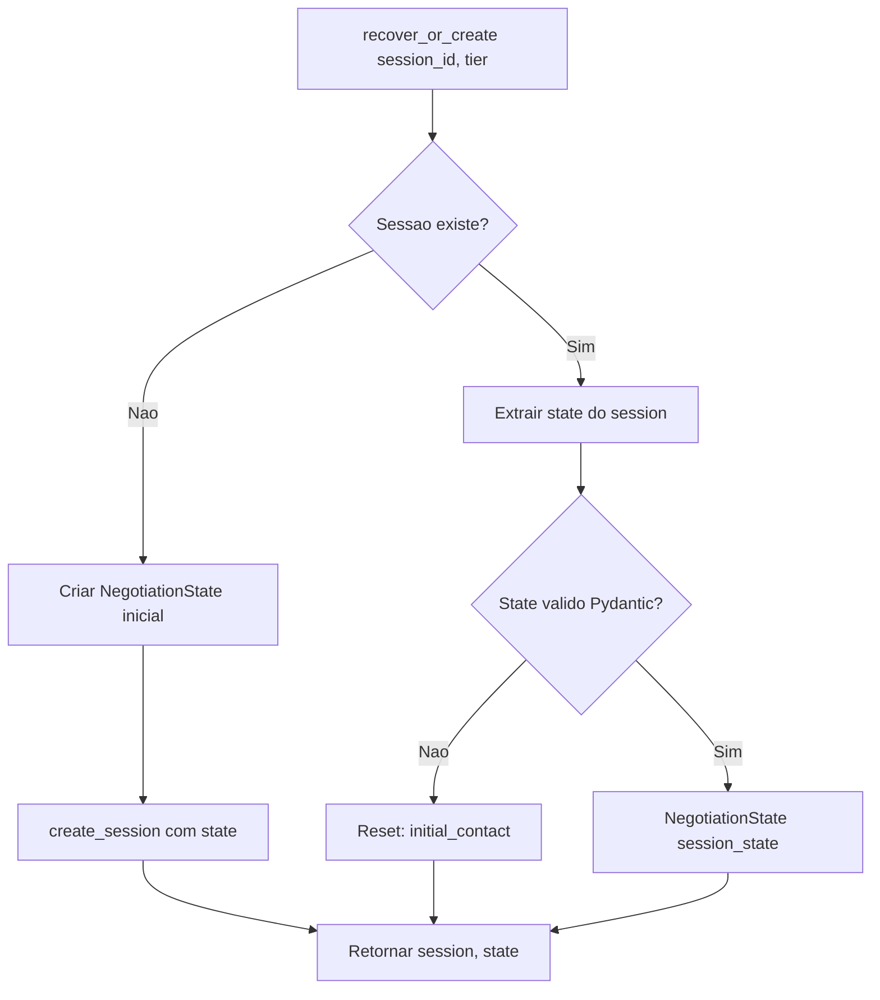
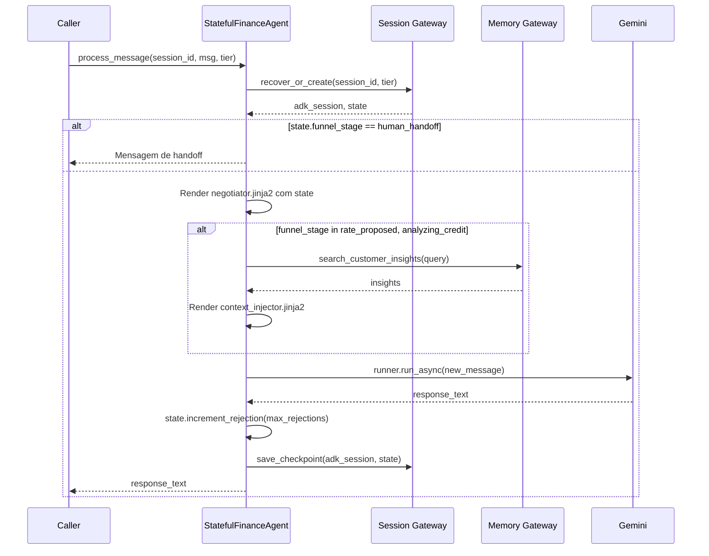

# Aula: Agente 3 — The Memory

Este documento explica passo a passo a arquitetura, o funcionamento e os conceitos avançados do **Agente 3 - The Memory**, um agente de IA stateful para negociação de financiamento automotivo construído com Google ADK e Gemini.

---

## 1. Introdução e Problema

### O que é um agente amnésico?

Um **agente amnésico** é aquele que, a cada nova mensagem do usuário, não “lembra” do que aconteceu antes. Para compensar, a aplicação reenvia **todo o histórico da conversa** no prompt. O LLM recebe algo como:

- Mensagem 1 do cliente  
- Resposta 1 do agente  
- Mensagem 2 do cliente  
- Resposta 2 do agente  
- …  
- Mensagem N do cliente  

Assim o modelo consegue manter coerência, mas isso gera dois problemas sérios:

1. **Custo (FinOps)**  
   Cada requisição envia milhares de tokens de histórico. Em escala, o gasto com API do LLM dispara.

2. **Fragilidade**  
   Se o servidor reiniciar, a sessão cair ou a conversa “esfriar” de um dia para o outro, o contexto se perde. O agente “esquece” a taxa que propôs, o perfil do cliente e irrita usuários (especialmente os premium).

### Contexto do domínio

Neste laboratório, o agente atua como **negociador de financiamento automotivo** em um banco. Ele precisa:

- Reter o cliente com um tom profissional  
- Oferecer taxas adequadas ao perfil de crédito  
- Respeitar um limite de recusas (ex.: 3) e, ao atingi-lo, fazer **handoff** para um humano  

Para isso, o agente precisa de **memória**: saber em que etapa do funil está, quantas vezes o cliente recusou e qual taxa foi proposta — sem depender de reenviar o chat inteiro a cada turno.

---

## 2. Visão Geral da Arquitetura

O projeto abandona o anti-pattern do agente amnésico dividindo a persistência em **duas camadas** orquestradas por **Gateways**:

1. **Short-Term Memory (Session Gateway)**  
   Guarda o **estado atual** da negociação (FSM) no Vertex AI Session Service. Contadores, estágio do funil e perfil do cliente ficam em um “checkpoint” que é recuperado e atualizado a cada turno.

2. **Long-Term Memory (Memory Gateway)**  
   Acesso **pontual** a um Vector Search (Vertex AI) para buscar insights do histórico do cliente e injetar no prompt (RAG), apenas quando o estágio do funil justifica.

O orquestrador (`StatefulFinanceAgent`) integra o LLM do Google ADK com esses dois gateways e com um modelo de estado tipado (Pydantic).



### Papel de cada módulo

| Módulo | Arquivo | Função |
|--------|---------|--------|
| Orquestrador | `src/agent_router.py` | Integra gateways + LLM; processa mensagem, injeta estado e RAG no prompt |
| Short-Term Memory | `src/session_gateway.py` | Recupera/cria sessão e salva checkpoint (OCC, retry) |
| Long-Term Memory | `src/memory_gateway.py` | Busca insights do cliente no Vector Search (RAG), com degradação graciosa |
| Modelo de Estado | `src/state_models.py` | FSM tipada (Pydantic): estágios do funil, contadores, versão para OCC |
| Telemetria | `src/telemetry.py` | Calcula custo em tokens (stateful vs amnésico) e relatório FinOps |
| Exceções | `src/exceptions.py` | Hierarquia de erros (recuperação de sessão, OCC, vector search, etc.) |

---

## 3. Camada de Modelos de Estado (FSM)

Arquivo: **`src/state_models.py`**

O estado da negociação é modelado como uma **Máquina de Estados Finita (FSM)** com tipos rígidos. Isso evita que o LLM ou um bug corrompa o checkpoint com valores inválidos.

### NegotiationState (Pydantic)

```python
from typing import Literal
from pydantic import BaseModel, Field

class NegotiationState(BaseModel):
    funnel_stage: Literal["initial_contact", "analyzing_credit", "rate_proposed", "contract_signed", "human_handoff"]
    rejection_count: int = Field(default=0, ge=0)
    proposed_rate: float | None = None
    customer_tier: Literal["standard", "premium"]
    version: int = Field(default=1, ge=1, description="OCC: incrementado a cada save")
```

- **funnel_stage**  
  Estágio atual do funil; só aceita um dos cinco valores (Literal). Qualquer outro valor (ex.: inventado pelo LLM) é rejeitado pelo Pydantic.

- **rejection_count**  
  Quantas vezes o cliente recusou (>= 0). Usado para acionar o Circuit Breaker (handoff).

- **proposed_rate**  
  Taxa proposta nesta negociação (ou `None` se ainda não houve proposta).

- **customer_tier**  
  Perfil do cliente (`"standard"` ou `"premium"`), vindo da aplicação, não do texto do LLM.

- **version**  
  Contador usado no **OCC (Optimistic Concurrency Control)**:
  - Ao salvar, o sistema compara a versão em memória com a versão no storage.
  - Se forem diferentes, outro processo já salvou (conflito) e lança `ConcurrentWriteError`.

### Diagrama da Máquina de Estados



Os estágios representam o funil de vendas; a transição para `human_handoff` é disparada pelo método `increment_rejection()` quando `rejection_count >= max_rejections` (ex.: 3).

### Circuit Breaker: increment_rejection()

```python
def increment_rejection(self, max_rejections: int = 3) -> None:
    self.rejection_count += 1
    if self.rejection_count >= max_rejections:
        self.funnel_stage = "human_handoff"
```

- A cada recusa do cliente, o orquestrador chama `increment_rejection(max_rejections)` (valor vindo do YAML).
- Ao atingir o limite, o estágio muda para `human_handoff`: o “circuit breaker” abre e o agente para de tentar vender e avisa que vai transferir para um humano.

### OCC: bump_version()

```python
def bump_version(self) -> None:
    self.version += 1
```

- Chamado **antes** de persistir o checkpoint.
- Quem salva verifica se a versão no storage ainda é a mesma que a que tinha ao ler; se não for, outro writer já persistiu e deve-se lançar `ConcurrentWriteError` em vez de sobrescrever.

---

## 4. Short-Term Memory (Session Gateway)

Arquivo: **`src/session_gateway.py`**

O **Session Gateway** é a abstração de **memória de curto prazo**: ele persiste e recupera o estado da FSM (checkpoint) usando o **Google ADK Session Service** (Vertex AI ou mock em memória).

### Modos de operação

- **Vertex AI**  
  `USE_VERTEX_SESSION` ativo e `GOOGLE_CLOUD_PROJECT` definido → usa `VertexAiSessionService`.
- **Mock**  
  Caso contrário → usa `InMemorySessionService` (útil para desenvolvimento e testes sem GCP).

### Fluxo: recover_or_create()

Objetivo: para um `session_id` e um `tier`, obter a sessão ADK e o `NegotiationState` (recuperando do checkpoint ou criando estado inicial).



- Chama `get_session` (ou `get_session_sync` no mock).
- Se não houver sessão: cria `NegotiationState(funnel_stage="initial_contact", customer_tier=tier)` e `create_session` com esse state.
- Se houver: extrai o state (ignorando chaves com prefixos `app:`, `user:`, `temp:`), valida com `NegotiationState(**session_state)`. Se der erro de validação (checkpoint corrompido), faz reset para `initial_contact`.

### Persistência: save_checkpoint() e OCC

Antes de persistir:

1. Busca a sessão atual no storage.
2. Compara `current_version` (do storage) com `state.version` (em memória).
3. Se forem diferentes → lança `ConcurrentWriteError` (outro writer salvou no meio).
4. Se iguais → chama `state.bump_version()` e persiste via `append_event` com `EventActions(state_delta=state.model_dump())`.

Assim o checkpoint é atualizado com controle de concorrência otimista (OCC).

### Retry com Exponential Backoff

Operações de rede usam **tenacity** para retry:

- Até 3 tentativas.
- Espera exponencial entre tentativas (ex.: 2s, 4s, até 10s).
- Em `save_checkpoint`, não faz retry em `ConcurrentWriteError` (conflito de versão), apenas em falhas transitórias.

---

## 5. Long-Term Memory (Memory Gateway)

Arquivo: **`src/memory_gateway.py`**

O **Memory Gateway** abstrai a **memória de longo prazo**: busca no **Vertex AI Vector Search** (Memory Bank Service) insights sobre o cliente para enriquecer o prompt (RAG).

### Quando é usada

O orquestrador só chama o Memory Gateway quando o estágio do funil está em `rate_proposed` ou `analyzing_credit`. Fora isso, não há busca vetorial (economia de custo e latência).

### Graceful Degradation

- Se `VECTOR_SEARCH_ENDPOINT_ID` não estiver configurado → modo **mock**:
  - Query contendo `"sessao_premium"` → retorna um texto fixo (cliente conservador, negocia taxas agressivamente).
  - Caso contrário → retorna “Nenhum histórico prévio encontrado para este CPF.”
- Se o Vector Search estiver configurado mas a busca falhar (rede, limite, etc.):
  - Retry com a mesma política (3 tentativas, exponential backoff).
  - Após esgotar retries, **não propaga exceção**: retorna string vazia. O agente segue respondendo sem o contexto RAG (degradação graciosa).

A busca síncrona do SDK é executada em thread separada via `asyncio.to_thread()` para não bloquear o event loop.

---

## 6. Orquestrador Principal (Agent Router)

Arquivo: **`src/agent_router.py`**

A classe **StatefulFinanceAgent** é o orquestrador: recebe a mensagem do cliente, recupera/atualiza estado, monta o prompt (estado + RAG quando aplicável), chama o LLM e persiste o novo checkpoint.

### Injeção de Dependência (IoC)

O agente **não** instancia os gateways internamente. Eles são passados no construtor:

```python
def __init__(
    self,
    session_gw: NegotiationSessionGateway,
    memory_gw: LongTermMemoryGateway,
    *,
    policy_path: Path | None = None,
):
    self.session_gw = session_gw
    self.memory_gw = memory_gw
    self._max_rejections = _load_max_rejections(policy_path)
    # ... templates Jinja2, LlmAgent, Runner
```

Isso facilita testes (mocks) e troca de implementações sem alterar o orquestrador.

### Fluxo completo: process_message()

Diagrama sequencial resumido:



Passo a passo:

1. **Recuperar estado**  
   `recover_or_create(session_id, customer_tier)` → retorna `adk_session` e `state` (NegotiationState).

2. **Circuit breaker**  
   Se `state.funnel_stage == "human_handoff"`, retorna mensagem fixa de transferência e não chama o LLM.

3. **System prompt**  
   Renderiza `negotiator.jinja2` com `funnel_stage`, `proposed_rate`, `rejection_count`, `customer_tier` e atribui a `self.llm_agent.instruction`.

4. **RAG condicional**  
   Se `funnel_stage in ("rate_proposed", "analyzing_credit")`, chama `memory_gw.search_customer_insights(query)` e, se houver texto, monta o prompt do usuário com `context_injector.jinja2` (base_prompt + long_term_insights).

5. **Chamada ao LLM**  
   Monta `Content(role="user", parts=[Part(text=contextual_prompt)])` e usa `runner.run_async(user_id, session_id, new_message)`, acumulando o texto da resposta.

6. **Atualizar estado**  
   `state.increment_rejection(max_rejections=self._max_rejections)`. Se o limite for atingido, `funnel_stage` passa a `human_handoff`.

7. **Persistir**  
   `await self.session_gw.save_checkpoint(adk_session, state)` (com OCC e append_event).

8. **Retorno**  
   Devolve `response_text` ao caller.

---

## 7. Templates de Prompt (Jinja2)

### negotiator.jinja2 (system prompt)

Arquivo: **`prompts/negotiator.jinja2`**

Define o papel do agente e injeta a **Máquina de Estados** no prompt:

```jinja2
Você é um negociador sênior de financiamento automotivo em um grande banco.
...
MÁQUINA DE ESTADOS ATUAL:
Fase do Funil: {{ funnel_stage }}
Taxa Proposta Atualmente: {{ proposed_rate | default("Nenhuma", true) }}
Tentativas de Recusa do Cliente: {{ rejection_count }}
Perfil do Cliente: {{ customer_tier }}

Diretrizes:
1. Se a 'Taxa Proposta' for 'Nenhuma', não se comprometa com valores até consultar o perfil.
2. Se o cliente recusar a taxa, use técnicas de persuasão.
3. Se o cliente recusar 3 vezes (rejection_count >= 3), avise que você irá transferi-lo para um gerente humano (Handoff)...
```

Assim o LLM “vê” o estado atual da FSM em cada turno, sem precisar do histórico completo.

### context_injector.jinja2 (RAG)

Arquivo: **`prompts/context_injector.jinja2`**

Usado quando há resultado da memória de longo prazo:

```jinja2
{{ base_prompt }}

=== MEMÓRIA DE LONGO PRAZO RECUPERADA (LONG-TERM MEMORY) ===
Os seguintes insights foram recuperados do histórico consolidado do cliente:
{{ long_term_insights }}
============================================================

Utilize as informações acima para personalizar a sua resposta...
```

O `base_prompt` é a mensagem atual do cliente; `long_term_insights` é o texto retornado pelo Memory Gateway (vector search ou mock).

---

## 8. FinOps e Telemetria

Arquivo: **`src/telemetry.py`**

A classe **FinOpsTelemetry** compara o custo da abordagem **stateful** (checkpoint + RAG pontual) com um baseline **amnésico** (enviar um histórico grande a cada request).

### Cálculo do custo stateful

- Lê `config/memory_policy.yaml` (seção `finops`): `cost_per_1k_input`, `cost_per_1k_output`.
- Usa **tiktoken** (encoding `cl100k_base`) para contar tokens do prompt e da resposta (ou aproximação por caracteres se tiktoken falhar).
- `calculate_stateful_cost(prompt_text, response_text)` retorna o custo em dólar daquele request.

### Baseline amnésico

- `get_amnesic_baseline_cost()` usa `amnesic_payload_tokens` do YAML (ex.: 10.000) e aplica só o custo de input, simulando “enviar 10k tokens de histórico em todo turno”.

### Relatório

- `print_savings_report(stateful_cost)` monta uma tabela (Rich) comparando:
  - Amnésico (histórico completo) vs Stateful (checkpoint + vetorial) e a economia em USD e em percentual.

Isso permite mostrar em aula ou em relatório que o padrão stateful reduz custo de tokens em relação ao envio de histórico completo.

---

## 9. Hierarquia de Exceções

Arquivo: **`src/exceptions.py`**

Todas as exceções do subsistema de memória derivam de **MemorySystemError**:

| Exceção | Quando é usada |
|--------|----------------------------------|
| **MemorySystemError** | Base; erros gerais do sistema de memória. |
| **StateValidationError** | Estado de sessão inválido ou corrompido (validação Pydantic). |
| **SessionRecoveryError** | Falha ao carregar ou criar checkpoint (get_session/create_session). |
| **VectorSearchError** | Long-Term Memory (Vertex Vector Search) indisponível ou falha na busca. |
| **ConcurrentWriteError** | Conflito OCC: versão no storage diferente da esperada ao salvar. |

Usar exceções específicas permite ao chamador tratar recuperação de sessão, degradação de RAG e conflitos de escrita de forma separada.

---

## 10. Configurações (YAML)

### memory_policy.yaml

Arquivo: **`config/memory_policy.yaml`**

- **finops**  
  - `cost_per_1k_input` / `cost_per_1k_output`: preço por 1k tokens (ex.: Gemini 1.5 Pro).  
  - `amnesic_payload_tokens`: tamanho do “histórico completo” usado no baseline amnésico (ex.: 10.000).

- **vector_search**  
  - `max_documents`, `min_similarity_score`: limites para a busca vetorial (usados pela infra do Vector Search).

- **session**  
  - `ttl_hours`: tempo de vida do checkpoint (ex.: 48).  
  - `max_rejections`: limite de recusas antes do handoff (ex.: 3). Esse valor é lido pelo orquestrador em `_load_max_rejections()`.

### safety_settings.yaml

Arquivo: **`config/safety_settings.yaml`**

Define os níveis de bloqueio do Vertex AI para categorias de conteúdo (assédio, ódio, conteúdo sexualmente explícito, conteúdo perigoso). Ex.: `BLOCK_MEDIUM_AND_ABOVE`. O agente pode carregar esse arquivo e repassar ao cliente do Gemini quando configurado.

---

## 11. Entry Point e Demonstração

Arquivo: **`src/main.py`**

O ponto de entrada da demo:

1. **Setup**  
   `load_dotenv(override=True)`, logging básico.

2. **Construção**  
   Cria `NegotiationSessionGateway()`, `LongTermMemoryGateway()`, `StatefulFinanceAgent(session_gw, memory_gw)` e `FinOpsTelemetry()`.

3. **Cenário**  
   Uma única sessão (`sessao_premium_998877`) e três mensagens simuladas:
   - “Olá, gostaria de financiar um SUV elétrico de R$ 350.000.”
   - “A taxa que vocês ofereceram ontem está muito alta. Não aceito 1.49%.”
   - “Ainda acho alto. Não vou fechar o financiamento assim.”

4. **Loop**  
   Para cada mensagem: `agent.process_message(session_id, msg, customer_tier="premium")`, exibe a resposta, acumula custo com `telemetry.calculate_stateful_cost(msg, response_text)`.

5. **Relatório**  
   Ao final, `telemetry.print_savings_report(total_cost)` mostra a tabela FinOps.

Na terceira mensagem, `increment_rejection` atinge `max_rejections` (3); na próxima recuperação o estágio já é `human_handoff` e o agente retorna a mensagem de transferência sem chamar o LLM.

---

## 12. Conceitos Avançados (Aprofundamento)

### Defense in Depth

Várias camadas de proteção para evitar corrupção e falhas:

- **Pydantic**  
  Garante que o estado só tenha valores válidos (estágios e tipos corretos).
- **OCC**  
  Evita que dois writers sobrescrevam um ao outro.
- **Circuit Breaker**  
  Limita tentativas de negociação e força handoff após N recusas.
- **Graceful Degradation**  
  Se Vector Search falhar, o agente continua sem RAG em vez de quebrar.

### OCC (Optimistic Concurrency Control) — analogia

Imagine um documento compartilhado:

- Você lê a versão 5, edita e tenta salvar.
- O sistema só aceita se o documento ainda estiver na versão 5 no servidor.
- Se outro usuário já tiver salvo (versão 6), seu save é rejeitado (conflito). Aqui, “versão” é o campo `version` do `NegotiationState`; o “save” é o `save_checkpoint` com verificação de versão antes do `append_event`.

### Circuit Breaker na FSM

Após um número configurável de “falhas” (recusas do cliente), o sistema para de tentar a mesma ação (continuar oferecendo) e muda para um estado seguro: `human_handoff`. Isso protege a experiência do cliente e a operação (evita loop infinito de ofertas recusadas).

### Graceful Degradation nos Gateways

- **Session Gateway**  
  Em falha de recuperação após retries, sobe `SessionRecoveryError`; o caller pode decidir criar nova sessão ou informar o usuário.
- **Memory Gateway**  
  Em falha persistente da busca, **não** propaga exceção: retorna string vazia. O agente segue sem contexto RAG (resposta menos personalizada, mas o fluxo não quebra).

### Injeção de Dependência (IoC)

O orquestrador não instancia Session Gateway nem Memory Gateway; recebe implementações por construtor. Benefícios:

- Testes com mocks ou fakes.
- Troca de implementação (ex.: outro backend de sessão) sem alterar o core do agente.

### Async/Await e non-blocking I/O

- `process_message` é `async`; recuperação de sessão, busca vetorial e persistência são assíncronas (ou rodam em thread com `to_thread`), evitando bloquear o event loop.
- O Runner do ADK usa `run_async` e retorna um async generator de eventos; a resposta é consumida em streaming.

### Exponential Backoff

Em retries (tenacity), a espera entre tentativas cresce exponencialmente (ex.: 2s, 4s, 8s, cap 10s). Reduz pressão sobre o serviço em caso de throttling (ex.: 429) e falhas transitórias de rede.

---

## 13. Testes

O projeto inclui três módulos de teste que validam FSM, Session Gateway e Memory Gateway.

### test_session_fsm.py

- **test_negotiation_state_initialization**  
  Estado inicial com `initial_contact`, `rejection_count=0`, `version=1`, etc.
- **test_fsm_circuit_breaker_default_max_rejections**  
  Com `max_rejections=3`, após 3 chamadas a `increment_rejection()` o estágio vira `human_handoff`.
- **test_fsm_circuit_breaker_configurable_max_rejections**  
  Com `max_rejections=2`, handoff na segunda recusa.
- **test_state_version_bump**  
  `bump_version()` incrementa `version`.
- **test_invalid_funnel_stage_rejected**  
  Pydantic rejeita `funnel_stage` inválido (ex.: string inventada).

### test_session_gateway.py

- **test_session_gateway_recover_or_create_async**  
  Em modo mock, `recover_or_create` retorna estado inicial com `version==1` e `funnel_stage=="initial_contact"`.
- **test_session_gateway_save_checkpoint_async**  
  Após `increment_rejection` e `save_checkpoint`, uma nova `recover_or_create` na mesma sessão retorna estado com `rejection_count` atualizado e versão persistida.

### test_memory_recall.py

- **test_ltm_gateway_graceful_degradation**  
  Com gateway em mock (sem endpoint): query com “sessao_premium” retorna texto com “cliente é conservador”; query sem match retorna “Nenhum histórico prévio encontrado”.

---

## 14. Como Executar

### Pré-requisitos

- Python 3.11+ (recomendado).
- Conta Google (API Key ou GCP com Vertex AI).

### Instalação

```bash
cd agente-3-the-memory
python -m venv venv
# Windows
venv\Scripts\activate
# Linux/Mac
source venv/bin/activate
pip install -r requirements.txt
```

### Configuração

**Opção A — Google AI (API Key)**  
Crie uma API key no [Google AI Studio](https://aistudio.google.com/apikey) e defina:

```bash
# .env ou export
GOOGLE_API_KEY=sua-api-key
```

**Opção B — Vertex AI**  
Para Session Service e Vector Search reais:

```bash
gcloud auth application-default login
# .env ou export
GOOGLE_GENAI_USE_VERTEXAI=1
GOOGLE_CLOUD_PROJECT=seu-projeto
GOOGLE_CLOUD_LOCATION=us-central1
USE_VERTEX_SESSION=1
VECTOR_SEARCH_ENDPOINT_ID=id-do-endpoint  # opcional; sem isso usa mock
```

Sem `USE_VERTEX_SESSION` e sem projeto, o Session Gateway usa mock em memória. Sem `VECTOR_SEARCH_ENDPOINT_ID`, o Memory Gateway usa mock.

### Rodar a demonstração

```bash
python -m src.main
```

Saída esperada: três turnos de conversa, com a terceira mensagem levando ao handoff (após 3 recusas), e em seguida a tabela FinOps comparando custo stateful vs amnésico.

### Rodar os testes

```bash
pytest tests/ -v
```

Requer dependências de teste (pytest, pytest-asyncio); o ADK é importado condicionalmente nos testes do session gateway.

---

## Resumo

O **Agente 3 - The Memory** é um exemplo didático de agente **stateful** que:

- Usa **Short-Term Memory** (Session Gateway + checkpoint FSM) para não reenviar o histórico inteiro a cada turno.
- Usa **Long-Term Memory** (Memory Gateway + Vector Search) de forma condicional para RAG.
- Mantém a FSM tipada com **Pydantic** e **OCC** para evitar corrupção e conflitos de escrita.
- Aplica **Circuit Breaker** (handoff após N recusas) e **Graceful Degradation** nos gateways.
- Integra **FinOps** (telemetria de tokens e comparação com baseline amnésico).

Com isso, você tem um material completo para uma aula que cobre desde o problema do agente amnésico até padrões avançados de memória, resiliência e custo em agentes de IA.
