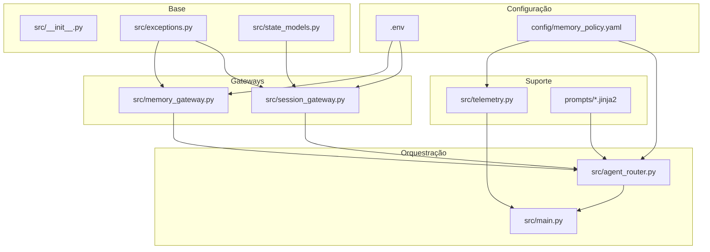
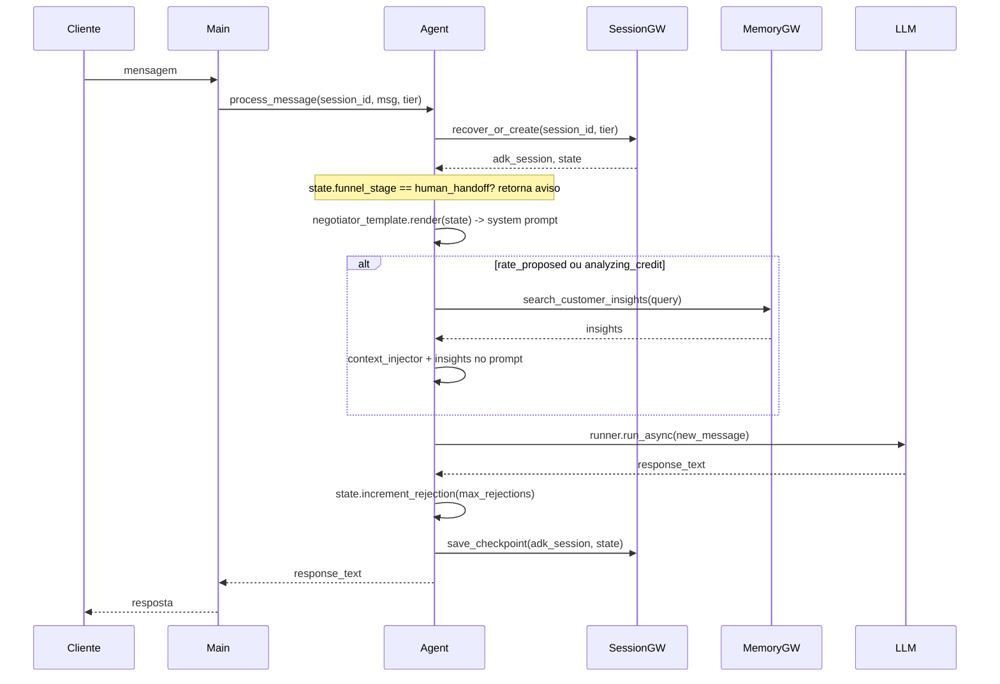

# Guia do Professor — Agente 3: The Memory

Este documento é voltado ao **professor**. O objetivo é permitir que você explique o projeto **arquivo por arquivo** em aula, na ordem certa das dependências, e que os alunos entendam como cada parte contribui para o **gerenciamento de memória** (Short-Term e Long-Term). Aqui você encontra também o **passo a passo para executar** o projeto em ambiente local ou com mocks.

Para aprofundamento teórico (agente amnésico, FSM, FinOps, OCC), consulte [AULA.md](AULA.md).

---

## Visão geral do projeto

O projeto é um **agente stateful de negociação de financiamento automotivo** que usa **duas camadas de memória** orquestradas por gateways: **Short-Term** (checkpoint da sessão/FSM) e **Long-Term** (RAG vetorial para insights do cliente). Assim evitamos o anti-pattern do **agente amnésico**, que reenvia todo o histórico a cada turno (custoso e frágil). O estado da negociação é persistido em checkpoint e recuperado a cada mensagem; o RAG é usado de forma pontual quando o estágio do funil justifica.

---

## Mapa de arquivos

| Caminho | Papel em uma linha | Tipo |
|---------|---------------------|------|
| `.env` | Variáveis de ambiente (projeto GCP, região, flags de Vertex/sessão). | Config |
| `config/memory_policy.yaml` | Políticas de sessão (max_rejections, ttl), FinOps e vector_search. | Config |
| `config/safety_settings.yaml` | Configurações de segurança do modelo (citado no projeto). | Config |
| `prompts/negotiator.jinja2` | System prompt do negociador (FSM, taxa, recusas, perfil). | Template |
| `prompts/context_injector.jinja2` | Template que injeta insights da Long-Term Memory no prompt do usuário. | Template |
| `src/__init__.py` | Versão do pacote; identifica `src` como pacote Python. | Código |
| `src/exceptions.py` | Exceções do sistema de memória (OCC, recuperação, vetorial). | Código |
| `src/state_models.py` | Modelo Pydantic da FSM (NegotiationState). | Código |
| `src/session_gateway.py` | Gateway da Short-Term Memory: checkpoint, OCC, retry. | Código |
| `src/memory_gateway.py` | Gateway da Long-Term Memory: RAG/vetorial, degradação graciosa. | Código |
| `src/telemetry.py` | Cálculo FinOps (custo stateful vs amnésico) e relatório. | Código |
| `src/agent_router.py` | Orquestrador: integra gateways, LLM e políticas. | Código |
| `src/main.py` | Ponto de entrada: monta gateways, agente, telemetry e roda a demo. | Código |

Na raiz: `requirements.txt` e `pyproject.toml` definem dependências; `README.md` traz instalação e opções de autenticação.

---

## Grafo de dependências

A ordem em que os módulos **dependem** uns dos outros (imports e leitura de config) é a seguinte:



Resumo: **main** usa agent_router, session_gateway, memory_gateway e telemetry. **agent_router** usa session_gateway, memory_gateway, lê `memory_policy.yaml` e os templates em `prompts/`. **session_gateway** usa exceptions e state_models; **memory_gateway** usa apenas exceptions. **telemetry** só lê o YAML.

---

## Ordem didática sugerida

Siga esta ordem ao abrir e explicar os arquivos na aula. Cada item já teve suas dependências explicadas antes.

| Ordem | Arquivo | Por que nesta ordem |
|-------|---------|----------------------|
| 1 | `.env` | Toda a configuração de ambiente (projeto, região, flags) vem daqui. Os gateways de sessão e memória leem essas variáveis. |
| 2 | `config/memory_policy.yaml` | Define políticas de sessão (max_rejections, ttl), FinOps e vector_search. Lido por agent_router e telemetry. |
| 3 | `src/__init__.py` | Mostra que `src` é um pacote Python; só expõe a versão. |
| 4 | `src/exceptions.py` | Não depende de outros módulos do projeto; define os erros usados pelos gateways. |
| 5 | `src/state_models.py` | Modelo da FSM (NegotiationState) que o session_gateway persiste. Não depende de outros `src`. |
| 6 | `src/session_gateway.py` | Short-Term Memory: checkpoint, OCC, retry. Depende de exceptions e state_models. |
| 7 | `src/memory_gateway.py` | Long-Term Memory: RAG/vetorial e degradação graciosa. Depende só de exceptions. |
| 8 | `src/telemetry.py` | FinOps; lê a seção `finops` do memory_policy. Independente dos gateways. |
| 9 | `prompts/negotiator.jinja2` e `context_injector.jinja2` | System prompt e injeção de contexto; o agent_router usa esses templates. |
| 10 | `src/agent_router.py` | Orquestrador que une session_gw, memory_gw, LLM e políticas. Depende dos gateways, config e prompts. |
| 11 | `src/main.py` | Ponto de entrada: instancia gateways, agente e telemetry e roda o loop da demonstração. |

---

## Tabela: Arquivo × Memória

| Arquivo | Short-Term? | Long-Term? | Observação |
|---------|-------------|------------|------------|
| `.env` | — | — | Configura acesso a serviços que implementam as memórias. |
| `config/memory_policy.yaml` | Política (max_rejections, ttl) | Política (vector_search) | Regras usadas por quem usa memória. |
| `src/__init__.py` | — | — | Apenas versão do pacote. |
| `src/exceptions.py` | — | — | Erros usados pelos gateways (OCC, recuperação, vetorial). |
| `src/state_models.py` | Sim (modelo persistido) | — | Estrutura do checkpoint (FSM). |
| `src/session_gateway.py` | **Sim** | Não | Checkpoint, OCC, retry; persiste NegotiationState. |
| `src/memory_gateway.py` | Não | **Sim** | RAG/vetorial; degradação graciosa se indisponível. |
| `src/telemetry.py` | — | — | Mede custo (stateful vs amnésico). |
| `prompts/*.jinja2` | Contexto (estado no prompt) | Contexto (insights no prompt) | Conteúdo que vai para o LLM. |
| `src/agent_router.py` | Usa session_gw | Usa memory_gw | Orquestra as duas memórias e o LLM. |
| `src/main.py` | — | — | Monta e executa o fluxo; não implementa memória. |

---

## Fluxo em um turno (para navegar mentalmente)

Ao abrir cada arquivo, você pode situá-lo neste fluxo:



---

## Passo a passo para executar

### Pré-requisitos

- **Python 3.11+** (ou a versão indicada no `README.md` / `pyproject.toml`).
- **Conta Google**: para o modelo LLM é necessário **Google AI (API Key)** ou **Vertex AI (Application Default Credentials)**. Sem isso o Gemini retorna erro de autenticação.
- Para **Vertex AI**: `gcloud auth application-default login` e projeto GCP configurado.

### Comandos (copiáveis)

```bash
# 1. Entrar no diretório do projeto
cd agente-3-the-memory

# 2. Criar e ativar ambiente virtual
python -m venv venv
# Windows:
venv\Scripts\activate
# Linux/macOS:
# source venv/bin/activate

# 3. Instalar dependências
pip install -r requirements.txt

# 4. Configurar ambiente (crie ou edite .env na raiz)
# Mínimo para rodar com MOCKS (sem Vertex Session nem Vector Search):
# GOOGLE_GENAI_USE_VERTEXAI=1
# GOOGLE_CLOUD_PROJECT=seu-projeto
# GOOGLE_CLOUD_LOCATION=us-east1
# Opcional: USE_VERTEX_SESSION=true para persistir sessão no Vertex
# Opcional: VECTOR_SEARCH_ENDPOINT_ID=... para Long-Term Memory real

# 5. Executar a demonstração
python -m src.main
```

### Variáveis de ambiente que o código usa

| Variável | Onde é usada | Efeito |
|----------|----------------|--------|
| `GOOGLE_CLOUD_PROJECT` | session_gateway, memory_gateway | Projeto GCP; sem ele + sem USE_VERTEX_SESSION → session em memória. |
| `GOOGLE_CLOUD_LOCATION` ou `GOOGLE_CLOUD_REGION` | session_gateway, memory_gateway | Região do Vertex. |
| `USE_VERTEX_SESSION` | session_gateway | `"1"` ou `"true"` → usa Vertex Session; caso contrário → InMemorySessionService. |
| `VECTOR_SEARCH_ENDPOINT_ID` | memory_gateway | Se definido → Vertex Vector Search; senão → mock (respostas fixas). |
| `GOOGLE_GENAI_USE_VERTEXAI` | SDK Gemini | Usar Vertex AI para o modelo (normalmente `1`). |

Sem Vertex configurado para sessão e vector search, o projeto **usa mocks** e ainda assim roda (ideal para aula sem infraestrutura GCP).

### O que esperar na saída

- Título da demo e mensagem de recuperação de checkpoint.
- Três turnos: mensagem do cliente → resposta do agente.
- Ao final, **relatório FinOps** (tabela comparando custo amnésico vs stateful e economia).

---

## Detalhamento por arquivo (na ordem didática)

Use estas seções ao abrir cada arquivo na aula.

---

### 1. `.env`

**Arquivo:** `.env` (raiz do projeto)

**O que é:** Arquivo de variáveis de ambiente (não versionado). Define projeto GCP, região e flags que ativam ou desativam Vertex Session e Vector Search.

**Como se conecta à memória:** Não implementa memória; configura os **serviços** que os gateways usam (Vertex Session = Short-Term, Vector Search = Long-Term). Sem as variáveis certas, os gateways usam mocks.

**Pontos para destacar em aula:**
- Por que não versionar: segredos e configuração por ambiente.
- `USE_VERTEX_SESSION` e `VECTOR_SEARCH_ENDPOINT_ID` controlam mock vs real.
- `GOOGLE_CLOUD_PROJECT` e `GOOGLE_CLOUD_LOCATION` são lidos em `session_gateway` e `memory_gateway`.

**Trechos-chave:** Nenhum código; apenas listar os nomes das variáveis e o efeito de tê-las ou não.

**Para o professor:** Mostre que o `main.py` chama `load_dotenv(override=True)` antes dos imports do `src`, para que todos os módulos já vejam o ambiente correto.

---

### 2. `config/memory_policy.yaml`

**Arquivo:** `config/memory_policy.yaml`

**O que é:** Configuração em YAML das políticas de memória e FinOps: sessão (max_rejections, ttl_hours), vector_search (limites, score) e finops (custos por token, payload amnésico).

**Como se conecta à memória:** Define **regras** usadas por quem gerencia memória: `max_rejections` (agent_router/state_models) e ttl (conceitual para sessão); vector_search para Long-Term; finops para telemetry.

**Pontos para destacar em aula:**
- `session.max_rejections`: quantas recusas antes do handoff (Circuit Breaker).
- `finops`: custo por 1k tokens e tamanho do payload amnésico para comparação.
- Ajuste de política sem novo deploy (só alterar YAML).

**Trechos-chave:** Chaves `session`, `finops`, `vector_search` e seus subcampos.

**Para o professor:** O agent_router chama `_load_max_rejections(policy_path)` e passa esse valor para `state.increment_rejection(max_rejections=...)`. Mostre o caminho config → código.

---

### 3. `src/__init__.py`

**Arquivo:** `src/__init__.py`

**O que é:** Inicialização do pacote `src`; expõe apenas `__version__`.

**Como se conecta à memória:** Não se conecta; apenas identifica o pacote.

**Pontos para destacar em aula:** Em Python, a pasta com `__init__.py` vira pacote importável (`from src.agent_router import ...`).

**Trechos-chave:** Uma linha: `__version__ = "1.0.0"`.

**Para o professor:** Rápido; serve para fechar o “mapa” do pacote antes de entrar nos módulos que importam uns aos outros.

---

### 4. `src/exceptions.py`

**Arquivo:** `src/exceptions.py`

**O que é:** Define as exceções do sistema de memória: base `MemorySystemError` e especializações para validação de estado, recuperação de sessão, falha de vector search e conflito de concorrência (OCC).

**Como se conecta à memória:** Não persiste nada; permite que os gateways **sinalizem** falhas específicas (ex.: checkpoint corrompido, outro writer salvou, Vector Search indisponível) e que o chamador trate ou degrade.

**Pontos para destacar em aula:**
- Hierarquia: uma base e várias específicas (tratamento por tipo).
- `SessionRecoveryError` e `ConcurrentWriteError` no session_gateway; `VectorSearchError` no memory_gateway.
- Nomes que documentam o domínio (não genéricos como `Exception`).

**Trechos-chave:** Classes `MemorySystemError`, `StateValidationError`, `SessionRecoveryError`, `VectorSearchError`, `ConcurrentWriteError`.

**Para o professor:** Ao chegar em session_gateway e memory_gateway, mostre onde cada exceção é `raise`d e por que isso ajuda (retry vs falha definitiva, degradação).

---

### 5. `src/state_models.py`

**Arquivo:** `src/state_models.py`

**O que é:** Modelo Pydantic da FSM da negociação: `NegotiationState` (funnel_stage, rejection_count, proposed_rate, customer_tier, version) e métodos `increment_rejection` e `bump_version`.

**Como se conecta à memória:** É o **conteúdo** da Short-Term Memory: o session_gateway persiste e recupera exatamente esse modelo (serializado como state_delta). O campo `version` é usado para OCC.

**Pontos para destacar em aula:**
- FSM tipada: só valores permitidos (Literal) e validação Pydantic.
- `version`: incrementado a cada save para detectar escritas concorrentes.
- `increment_rejection(max_rejections)`: quando atinge o limite, muda para `human_handoff`.

**Trechos-chave:** Classe `NegotiationState`, campos `funnel_stage`, `version`; métodos `increment_rejection` e `bump_version`.

**Para o professor:** Enfatize que o LLM não “inventa” campos: o checkpoint é sempre esse modelo. Isso evita corrupção do estado.

---

### 6. `src/session_gateway.py`

**Arquivo:** `src/session_gateway.py`

**O que é:** Gateway da **Short-Term Memory**: recupera ou cria sessão (Vertex AI Session Service ou mock), valida estado com Pydantic, aplica OCC no save e retry com backoff exponencial.

**Como se conecta à memória:** Implementa o **checkpoint** da sessão: `recover_or_create` devolve o estado atual; `save_checkpoint` persiste o estado via `append_event` com `state_delta`. Lê `.env` (GOOGLE_CLOUD_PROJECT, GOOGLE_CLOUD_LOCATION, USE_VERTEX_SESSION).

**Pontos para destacar em aula:**
- Mock vs Vertex: `USE_VERTEX_SESSION` e presença de `project_id` decidem InMemory vs VertexAiSessionService.
- OCC: antes de salvar, compara `version` no servidor com a do estado; se diferente, lança `ConcurrentWriteError`; senão chama `bump_version` e persiste.
- Retry: política com `stop_after_attempt(3)` e `wait_exponential`; em mock usa `asyncio.to_thread` para não bloquear.
- Função `_session_state_only`: filtra prefixos `app:`, `user:`, `temp:` para não poluir o NegotiationState.

**Trechos-chave:** Classe `NegotiationSessionGateway`; métodos `recover_or_create`, `save_checkpoint`; `_occ_check_and_bump_sync`; construção do `Event` com `EventActions(state_delta=state.model_dump())`.

**Para o professor:** Mostre o `version` e o `bump_version` para explicar OCC. Mostre onde `SessionRecoveryError` e `ConcurrentWriteError` são lançadas e que no retry não se re-tenta em caso de ConcurrentWriteError.

---

### 7. `src/memory_gateway.py`

**Arquivo:** `src/memory_gateway.py`

**O que é:** Gateway da **Long-Term Memory**: busca em Vector Search (Vertex AI) ou mock. Retry com backoff; em falha persistente retorna string vazia (graceful degradation).

**Como se conecta à memória:** Implementa o acesso **pontual** à memória de longo prazo (RAG): `search_customer_insights(query)` retorna texto para injetar no prompt. Lê `.env` (GOOGLE_CLOUD_PROJECT, GOOGLE_CLOUD_REGION, VECTOR_SEARCH_ENDPOINT_ID). Sem endpoint → mock.

**Pontos para destacar em aula:**
- Mock: se `VECTOR_SEARCH_ENDPOINT_ID` não estiver definido, respostas fixas (ex.: query com "sessao_premium").
- Graceful degradation: após esgotar retries, retorna `""` em vez de quebrar; o agente continua sem contexto RAG.
- `asyncio.to_thread` para não bloquear o event loop na busca síncrona.

**Trechos-chave:** Classe `LongTermMemoryGateway`; método `search_customer_insights`; em mock, o `if "sessao_premium" in query` e o `return ""` no except do `search_customer_insights`.

**Para o professor:** Contrastar com session_gateway: aqui não há “estado da conversa”, só **consulta** por query; a falha é tratada com degradação, não com exceção propagada (na API pública).

---

### 8. `src/telemetry.py`

**Arquivo:** `src/telemetry.py`

**O que é:** Cálculo de custo FinOps: tokens do request stateful (prompt + resposta) e custo hipotético amnésico (payload fixo do YAML); geração do relatório em tabela (Rich).

**Como se conecta à memória:** Não gerencia memória; **mede** o impacto da arquitetura stateful (menos tokens por request) em relação ao baseline amnésico.

**Pontos para destacar em aula:**
- Uso de `memory_policy.yaml` (seção `finops`) para custos por 1k tokens e tamanho do payload amnésico.
- tiktoken (cl100k_base) como aproximação de contagem de tokens; fallback `len(text)//4` se falhar.
- Relatório comparativo: stateful vs amnésico e percentual de economia.

**Trechos-chave:** Classe `FinOpsTelemetry`; métodos `calculate_stateful_cost`, `get_amnesic_baseline_cost`, `print_savings_report`.

**Para o professor:** Mostre que o `main` chama `calculate_stateful_cost` por turno e acumula; no final chama `print_savings_report(total_cost)`. Reforce a mensagem de FinOps: menos histórico no prompt = menos custo.

---

### 9. `prompts/negotiator.jinja2` e `prompts/context_injector.jinja2`

**Arquivos:** `prompts/negotiator.jinja2`, `prompts/context_injector.jinja2`

**O que é:** Templates Jinja2: o primeiro é o **system prompt** do negociador (FSM atual, taxa proposta, recusas, perfil); o segundo **injeta** os insights da Long-Term Memory no prompt do usuário.

**Como se conecta à memória:** O **estado** (Short-Term) é passado para o negotiator (funnel_stage, proposed_rate, rejection_count, customer_tier). Os **insights** (Long-Term) são passados para o context_injector (long_term_insights). O resultado vai para o LLM.

**Pontos para destacar em aula:**
- Negociador: variáveis `funnel_stage`, `proposed_rate`, `rejection_count`, `customer_tier` vêm do `NegotiationState`.
- Regra no prompt: “Se rejection_count >= 3, handoff”.
- Context injector: usado só em estágios como rate_proposed/analyzing_credit; insere bloco “MEMÓRIA DE LONGO PRAZO RECUPERADA”.

**Trechos-chave:** No negotiator, o bloco “MÁQUINA DE ESTADOS ATUAL” e as diretrizes; no context_injector, `{{ long_term_insights }}` e a instrução de uso.

**Para o professor:** No agent_router, mostre o `negotiator_template.render(...)` e o `injector_template.render(base_prompt=..., long_term_insights=...)` e em quais estágios o RAG é chamado.

---

### 10. `src/agent_router.py`

**Arquivo:** `src/agent_router.py`

**O que é:** Orquestrador do agente: integra session_gateway (Short-Term), memory_gateway (Long-Term), LLM (Google ADK Runner + Agent) e políticas (max_rejections do YAML). Método principal: `process_message(session_id, customer_message, customer_tier)`.

**Como se conecta à memória:** **Usa** as duas memórias: chama `session_gw.recover_or_create` e `session_gw.save_checkpoint`; em estágios adequados chama `memory_gw.search_customer_insights` e injeta no prompt. O estado (Short-Term) alimenta o system prompt; os insights (Long-Term) o context_injector.

**Pontos para destacar em aula:**
- Fluxo: recuperar estado → checar human_handoff → montar system prompt → (opcional) buscar insights e injetar → runner.run_async → increment_rejection → save_checkpoint.
- Injeção de dependências: session_gw e memory_gw recebidos no construtor (testável, substituível).
- Runner usa o mesmo `session_service` do session_gateway para que chat e checkpoint compartilhem a mesma sessão.
- Carregamento de `max_rejections` via `_load_max_rejections(policy_path)`.

**Trechos-chave:** Classe `StatefulFinanceAgent`; método `process_message`; uso de `negotiator_template.render(...)` e `injector_template.render(...)`; condição `state.funnel_stage in ("rate_proposed", "analyzing_credit")` para chamar RAG; `state.increment_rejection(max_rejections=self._max_rejections)` e `await self.session_gw.save_checkpoint(adk_session, state)`.

**Para o professor:** Este é o “centro” do desenho: mostre um turno completo seguindo o fluxo (recover → prompt → LLM → increment → save) e onde cada gateway é usado.

---

### 11. `src/main.py`

**Arquivo:** `src/main.py`

**O que é:** Ponto de entrada da aplicação: carrega `.env`, configura logging, instancia NegotiationSessionGateway, LongTermMemoryGateway, StatefulFinanceAgent e FinOpsTelemetry, e roda um loop assíncrono com três mensagens de demonstração e relatório FinOps.

**Como se conecta à memória:** Não implementa memória; **monta** os gateways e o agente e **dispara** o fluxo. Cada `agent.process_message` usa internamente as duas memórias.

**Pontos para destacar em aula:**
- `load_dotenv(override=True)` no início para que todos os módulos vejam o ambiente.
- Criação dos gateways sem parâmetros (usam env); agente recebe session_gw e memory_gw.
- Loop com `session_id` fixo para demonstrar persistência entre turnos.
- Acúmulo de custo por turno e `print_savings_report(total_cost)` no final.

**Trechos-chave:** Função `run_lab_async`: criação de session_gw, memory_gw, agent, telemetry; loop `for i, msg in enumerate(messages, 1)` com `await agent.process_message(...)` e `telemetry.calculate_stateful_cost`; `telemetry.print_savings_report(total_cost)`. `if __name__ == "__main__": run_lab()`.

**Para o professor:** Feche a aula mostrando que tudo que foi visto (env, config, state_models, gateways, prompts, agent) se reúne aqui em poucas linhas; o “como” está nos módulos que já foram explicados.

---

*Fim do guia. Para teoria e exercícios, use [AULA.md](AULA.md) e [LAB-DESAFIO.md](../LAB-DESAFIO.md).*
