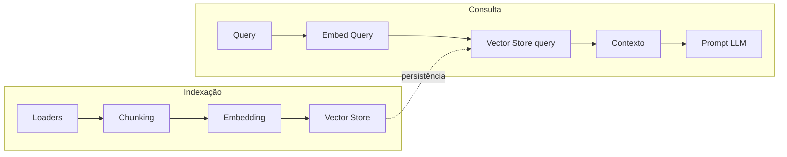

# Tutorial: Memória de Longo Prazo e RAG com ChromaDB

Este tutorial explica **Memória de Longo Prazo** e **RAG (Retrieval-Augmented Generation)** no contexto do projeto "The Memory", descrevendo o pipeline desde chunks, embedding e armazenamento vetorial até as consultas. Ao final, você terá uma visão detalhada de cada arquivo e a sequência para implementar RAG com ChromaDB.

---

## 1. Introdução: Memória de Longo Prazo e RAG

### Memória de curto prazo vs memória de longo prazo

Em agentes conversacionais, é útil separar dois tipos de memória:

- **Memória de curto prazo:** refere-se ao estado da **sessão atual**: etapa do funil (ex.: proposta de taxa feita), taxa proposta, número de recusas, etc. Esse estado é persistido em checkpoints (por exemplo, no Session Service do Google ADK) e tem vida útil limitada (ex.: 48 horas). É o “contexto da conversa agora”.

- **Memória de longo prazo:** é o **conhecimento persistido** em um repositório que sobrevive entre sessões. No nosso caso, são insights de clientes, políticas de crédito, FAQs e materiais do banco. Esse conhecimento é armazenado como **vetores** (embeddings) em um **vector store** e recuperado por **similaridade semântica** quando o agente precisa “lembrar” algo relevante para a conversa.

### O que é RAG?

**RAG (Retrieval-Augmented Generation)** é a técnica de **recuperar** trechos relevantes de um corpus (a memória de longo prazo) e **inserir** esses trechos no prompt enviado ao LLM. Assim, a geração é “aumentada” por dados recuperados, em vez de depender só do que está no histórico da conversa.

No nosso fluxo:

1. **Indexação:** documentos (CSV, JSON, PDF, TXT) são carregados, divididos em **chunks**, convertidos em **vetores (embeddings)** e gravados no **vector store** (ChromaDB, Vertex ou mock).
2. **Consulta:** quando o usuário envia uma mensagem, montamos uma **query** (ex.: sessão + trecho da mensagem), convertemos a query em vetor, buscamos no vector store os chunks **mais similares** e concatenamos o texto deles. Esse texto é injetado no prompt (por exemplo, numa seção “Memória de longo prazo recuperada”) e enviado ao LLM.

O diagrama abaixo resume os dois fluxos.



---

## 2. Pipeline em alto nível (ordem de execução)

### Indexação (CLI)

A indexação é acionada pelo módulo `src.indexing` via linha de comando:

```bash
python -m src.indexing --config config/indexing.yaml --input data/sample_insights.csv --output out/chunks.json --push
```

- **Entrada:** arquivos CSV, JSON, PDF ou TXT (ou diretórios contendo esses tipos).
- **Saída:**
  - Se `--output` for informado: arquivo JSON com a lista de chunks (texto, source, metadados).
  - Se `--push` for informado: os chunks são convertidos em vetores (embedding) e enviados ao vector store (Chroma, Vertex ou mock), conforme configurado em `config/memory_policy.yaml`.

Ou seja: **loaders → chunking → [opcional: embedding → vector store]**.

### Consulta (runtime)

Durante a execução do agente (`python -m src.main` ou via API):

1. O **router** ([src/agent_router.py](src/agent_router.py)) recebe a mensagem do usuário e recupera o estado da sessão.
2. Nas fases em que o RAG é usado (`rate_proposed`, `analyzing_credit`), o router monta uma **query enriquecida** (session_id + trecho da mensagem) e chama o **gateway** de memória de longo prazo.
3. O **LongTermMemoryGateway** ([src/memory_gateway.py](src/memory_gateway.py)) converte a query em vetor, consulta o vector store (Chroma/Vertex/mock), filtra por similaridade e metadados, e devolve o texto dos chunks concatenados.
4. Esse texto é injetado no prompt via template Jinja2 ([prompts/context_injector.jinja2](prompts/context_injector.jinja2)) e enviado ao LLM como parte da mensagem do usuário.

Referência de arquitetura: [docs/architecture.md](docs/architecture.md).

---

## 3. Configuração (ordem didática: config primeiro)

O pipeline usa dois arquivos de configuração. A **indexação** usa principalmente `config/indexing.yaml` e o **backend** do vector store (e parâmetros de busca) vêm de `config/memory_policy.yaml`. A **consulta** usa apenas `memory_policy.yaml` para vector search.

### config/indexing.yaml

Controla o pipeline de indexação:

| Seção / chave | Uso |
|---------------|-----|
| `chunking.chunk_size_chars` | Tamanho máximo de cada chunk em caracteres (ex.: 512). |
| `chunking.overlap_chars` | Sobreposição entre chunks na estratégia `fixed` (ex.: 64). |
| `chunking.strategy` | `fixed` (janela por tamanho) ou `by_paragraph` (agrupa parágrafos). |
| `csv.text_column` | Nome da coluna que contém o texto no CSV (fallback: `text`). |
| `csv.encoding` | Encoding do arquivo (ex.: utf-8). |
| `json.text_path` | Caminho do campo de texto no JSON (ex.: `content` ou `data.text`). |
| `json.encoding` | Encoding do JSON. |
| `pdf.merge_pages` | `true`: concatena todas as páginas e depois chunka; `false`: um documento por página. |
| `embedding.model` | Nome do modelo Vertex (ex.: text-multilingual-embedding-002). |
| `embedding.batch_size` | Quantidade de textos enviados por lote à API de embedding. |
| `vector_store.use_mock_if_unconfigured` | Se Vertex não estiver configurado, usar mock (ex.: JSONL). |

### config/memory_policy.yaml

Controla o vector search (tanto na indexação quanto na consulta):

| Seção / chave | Uso |
|---------------|-----|
| `vector_search.backend` | `chroma` \| `vertex` \| `mock`. Define onde indexação grava e onde o gateway busca. |
| `vector_search.max_documents` | Número máximo de documentos (chunks) retornados na busca. |
| `vector_search.min_similarity_score` | Score mínimo de similaridade; chunks abaixo são descartados (aplicado no gateway após a busca). |
| `vector_search.chroma.persist_directory` | Diretório onde o ChromaDB persiste os dados (ex.: `data/chroma`). |
| `vector_search.chroma.collection_name` | Nome da collection no Chroma (ex.: `customer_insights`). |
| `vector_search.vertex.*` | Usado quando `backend: vertex` (index_id, gcs_bucket, deployed_index_id, content_store_path, etc.). |
| `vector_search.mock.path` | Caminho do arquivo JSONL quando `backend: mock`. |

---

## 4. Detalhamento de cada arquivo (na sequência do pipeline)

A ordem abaixo segue o fluxo: **indexação** (loaders → chunking → embedding → vector_store → CLI) e depois **consulta** (memory_gateway → agent_router + template).

---

### 4.1 src/indexing/loaders.py

**O que este arquivo faz?**  
Carrega documentos de arquivos CSV, JSON, PDF e TXT e os normaliza para um formato único: lista de dicionários com `text` (conteúdo textual) e `metadata` (origem, session_id, tier, etc.).

**Função principal:**  
`load_documents_from_file(path, csv_text_column="content", json_text_path="content", pdf_merge_pages=True)`  
- **Retorno:** `[{"text": str, "metadata": dict}, ...]`. O `metadata` inclui sempre `source` (nome do arquivo) e, quando existirem, colunas/campos como `session_id`, `tier`, `page`, etc.

**Detalhes por formato:**

- **CSV:** usa `csv.DictReader`. A coluna de texto é configurável (`csv_text_column`); fallback para `text`. As demais colunas vão para `metadata`.
- **JSON:** suporta tanto uma lista de objetos quanto um único objeto. O campo de texto é definido por um “path” (`json_text_path`), por exemplo `content` ou `data.text`, resolvido pela função auxiliar `_get_nested`. Fallbacks: `body`, `text`. Outros campos vão para `metadata`.
- **PDF:** usa a biblioteca `pypdf` (`PdfReader`). Se `pdf_merge_pages=True`, todas as páginas são concatenadas em um único texto e retornadas como um documento; se `False`, cada página vira um documento com `metadata.page`.
- **TXT:** lê o arquivo como texto (UTF-8) e retorna um único documento com `text` igual ao conteúdo e `metadata.source` igual ao nome do arquivo.

**Onde a config é lida?**  
Os parâmetros do loader (coluna de texto, path JSON, merge de páginas) vêm do CLI ([src/indexing/__main__.py](src/indexing/__main__.py)), que por sua vez lê `config/indexing.yaml` (seções `csv`, `json`, `pdf`).

**Exemplos no repositório:**  
- [data/sample_insights.csv](data/sample_insights.csv): colunas `session_id`, `customer_id`, `tier`, `content`; cada linha vira um documento com `text` = valor de `content` e `metadata` com os demais campos.  
- [data/sample_policies.json](data/sample_policies.json): lista de objetos com `tipo`, `tier`, `vigencia`, `content`; cada item vira um documento com `text` = `content` e metadados preservados.

---

### 4.2 src/indexing/chunking.py

**O que este arquivo faz?**  
Divide um texto longo em pedaços (chunks) de tamanho controlado. Chunks menores cabem no limite do modelo de embedding e costumam melhorar a precisão da busca (cada chunk representa uma unidade semântica menor).

**Função principal:**  
`chunk_text(text, chunk_size, overlap=0, strategy="fixed")`  
- **Retorno:** lista de strings (os chunks).

**Estratégias:**

- **`fixed`:** janela deslizante de tamanho `chunk_size` caracteres, com `overlap` caracteres de sobreposição entre janelas consecutivas. Implementada em `_chunk_fixed`. O overlap ajuda a não “cortar” frases no meio e mantém um pouco de contexto entre chunks.
- **`by_paragraph`:** o texto é partido por `\n\n` (parágrafos); parágrafos são agrupados até o tamanho total não ultrapassar `chunk_size`. Implementada em `_chunk_by_paragraph`. Preserva fronteiras naturais de parágrafo.

**Uso no pipeline:**  
O CLI, para cada documento retornado pelos loaders, chama `chunk_text` com os parâmetros lidos de `indexing.yaml` (`chunk_size_chars`, `overlap_chars`, `strategy`). Cada chunk recebe depois `chunk_index` (índice no documento) e um `chunk_id` global no `__main__.py`.

**Onde a config é lida?**  
Em [src/indexing/__main__.py](src/indexing/__main__.py): `chunk_cfg = config.get("chunking")`, `chunk_size`, `overlap`, `strategy`.

---

### 4.3 src/indexing/embedding.py

**O que este arquivo faz?**  
Transforma textos em vetores numéricos (embeddings) para que a busca por similaridade no vector store seja feita no espaço vetorial. O mesmo modelo (ou lógica) deve ser usado na **indexação** e na **consulta**.

**Função principal:**  
`embed_texts(texts, model="text-multilingual-embedding-002", project_id=None, location=None, batch_size=5, for_query=False)`  
- **Retorno:** lista de listas de float (um vetor por texto).

**Comportamento:**

- Se as variáveis de ambiente `GOOGLE_CLOUD_PROJECT` e `GOOGLE_CLOUD_LOCATION` (ou `GOOGLE_CLOUD_REGION`) estiverem definidas, o código usa **Vertex AI Text Embedding** (função interna `_embed_vertex`). Os textos são enviados em lotes de `batch_size`; cada texto é truncado em 20.000 caracteres. O `src/main.py` e o script `scripts/rag_query.py` carregam o **`.env`** da raiz do projeto antes de importar o resto, então definir essas variáveis no `.env` é suficiente para usar Vertex nos embeddings.
- Caso contrário, usa **mock** (`_mock_embed`): um vetor determinístico gerado a partir do hash SHA-256 do texto, com **768 dimensões** (igual ao Vertex) para compatibilidade com Chroma ao alternar entre mock e Vertex.

**Vertex (SDK):**  
Os embeddings do Vertex são obtidos via **Google Gen AI SDK** (`google-genai`): `genai.Client(vertexai=True, project=..., location=...)` e `client.models.embed_content(model=..., contents=..., config=EmbedContentConfig(task_type=RETRIEVAL_QUERY|RETRIEVAL_DOCUMENT))`. Esse SDK substitui o antigo `vertexai.language_models.TextEmbeddingModel` (depreciado até jun/2026).

**Mock:**  
`_mock_embed(text, dim=768)` gera um vetor de 768 dimensões (igual ao Vertex); indexação e consulta devem usar o **mesmo modelo** (ou mock em ambos) para compatibilidade.

**Onde a config é lida?**  
O CLI passa `model` e `batch_size` a partir de `config/indexing.yaml` (seção `embedding`).

---

### 4.4 src/indexing/vector_store.py

**O que este arquivo faz?**  
Persiste os vetores e metadados no repositório de busca (vector store). O **backend** (Chroma, Vertex ou mock) é definido em `config/memory_policy.yaml` (seção `vector_search.backend`).

**Função principal:**  
`upsert_documents(ids, vectors, metadatas, config_path=None, index_endpoint_id=None, ...)`  
- **ids:** lista de identificadores (um por chunk).  
- **vectors:** lista de vetores (embeddings).  
- **metadatas:** lista de dicionários; cada um deve incluir pelo menos `content` (texto do chunk) para que a consulta possa retornar o conteúdo. No Chroma, metadados precisam ser serializáveis (str, int, float, bool); valores complexos são convertidos para string.

**Backends:**

1. **Chroma:**  
   - `_load_vector_search_config` lê `vector_search` do YAML; `_get_chroma_collection(persist_directory, collection_name)` obtém um `PersistentClient` e uma collection com espaço de distância **cosine**.  
   - `collection.add(ids=..., embeddings=..., documents=..., metadatas=...)`. O campo `documents` é preenchido com `content` de cada metadata para que o Chroma devolva o texto na query.  
   - Há um workaround para compatibilidade com chromadb e NumPy 2: definição de `np.float_` e `np.int_` quando não existirem (apontando para `np.float64` e `np.int64`).

2. **Vertex:**  
   - Gera um JSONL com `id` e `embedding`, faz upload para um bucket GCS, atualiza o índice via API (contentsDeltaUri) e mantém um **content store** local (arquivo JSONL id → content) para que a consulta possa recuperar o texto dos vizinhos retornados pelo Vertex.

3. **Mock:**  
   - Apenas faz append em um arquivo JSONL (ex.: `data/vector_store_mock.jsonl`), uma linha por documento com `id`, `vector` e `metadata`. Útil para testes e quando não há Chroma/Vertex configurado.

**Onde a config é lida?**  
`_load_vector_search_config(config_path)` carrega `config/memory_policy.yaml` (ou o caminho passado); o backend e os parâmetros de chroma/vertex/mock vêm dessa seção.

---

### 4.5 src/indexing/__main__.py

**O que este arquivo faz?**  
É o **CLI** do pipeline de indexação: lê a configuração, processa os arquivos de entrada, gera chunks e, opcionalmente, calcula embeddings e envia ao vector store.

**Uso na linha de comando:**  
- `--config`: caminho do YAML de indexação (default: `config/indexing.yaml`).  
- `--input` / `-i`: um ou mais arquivos ou diretórios (CSV, JSON, PDF, TXT).  
- `--output` / `-o`: arquivo JSON de saída com a lista de chunks (opcional).  
- `--push`: se presente, gera embeddings e chama `upsert_documents` (backend definido em `memory_policy.yaml`).

**Fluxo interno (função `run`):**  
Para cada arquivo de entrada:  
1. `load_documents_from_file(...)` com parâmetros de csv/json/pdf da config.  
2. Para cada documento: `chunk_text(text, chunk_size, overlap, strategy)`.  
3. Cada chunk vira um registro com `content`, `source`, `chunk_index`, `metadata` (incluindo `chunk_id` global). Tudo é acumulado em `all_chunks`.  
4. Se `--output` foi informado: grava `all_chunks` em JSON.  
5. Se `--push` foi informado:  
   - `embed_texts(texts, ...)` com modelo e batch_size da config (indexação → `for_query=False`).  
   - `upsert_documents(ids, vectors, metadatas, config_path=Path("config/memory_policy.yaml"), ...)`.  
   - Os `metadatas` passados ao vector store incluem `content` e `source` para que o Chroma (e o content store do Vertex) tenham o texto para devolver na consulta.

**Formato de cada chunk no JSON e no upsert:**  
- `content`: texto do chunk.  
- `source`: nome do arquivo de origem.  
- `chunk_index`: índice do chunk no documento.  
- `metadata`: dict com `chunk_id`, `session_id`, `tier`, etc., conforme o documento de origem.

---

### 4.6 src/memory_gateway.py

**O que este arquivo faz?**  
Abstrai a **consulta** à memória de longo prazo (RAG). O mesmo backend configurado para a indexação (chroma | vertex | mock) é usado aqui: o gateway lê `config/memory_policy.yaml` e inicializa o cliente correspondente.

**Classe principal:**  
`LongTermMemoryGateway(project_id=None, location=None, index_endpoint=None, config_path=None)`  
- No construtor, carrega `vector_search` do YAML e define:  
  - `_backend`, `_max_documents`, `_min_similarity_score`.  
  - Para **Chroma:** obtém a collection via `_get_chroma_collection(persist_directory, collection_name)` do `vector_store`.  
  - Para **Vertex:** endpoint e content store path (para mapear id → conteúdo após find_neighbors).  
  - Para **mock:** nenhum cliente externo; respostas fixas por substring.

**Método público:**  
`async search_customer_insights(query, where_metadata=None)`  
- A busca pesada é executada em thread separada (`asyncio.to_thread`) para não bloquear o event loop.  
- Internamente chama `_search_customer_insights_sync_retry` (com retry via tenacity). Em falha persistente, retorna string vazia (degradação graciosa).  
- **Retorno:** string com os textos dos chunks concatenados (separados por espaço), já filtrados por similaridade e ordenados; ou string vazia se não houver resultado ou em caso de erro após retries.

**Fluxo para backend Chroma (em `_search_customer_insights_sync`):**  
1. `embed_texts([query], for_query=True)` → um vetor para a query.  
2. `collection.query(query_embeddings=..., n_results=max_documents, where=where_metadata, include=["documents", "distances"])`.  
3. Chroma retorna distâncias no espaço cosine (menor distância = mais similar). Conversão para similaridade: `similarity = max(0, 1 - distance)`.  
4. Filtra documentos com `similarity >= min_similarity_score`.  
5. Ordena por similaridade decrescente e concatena o texto dos documentos restantes.

**Vertex:**  
Usa `find_neighbors` no endpoint; o conteúdo é lido do content store local (id → content). O `min_similarity_score` e a ordenação são aplicados no cliente, pois a API do Vertex devolve vizinhos por distância.

**Mock:**  
Não usa vetores; retorna um texto fixo conforme substring na query (ex.: se "sessao_premium" estiver na query, retorna o texto de exemplo do cliente premium; caso contrário, mensagem de “nenhum histórico”).

**Parâmetros de config:**  
- `max_documents`: limite de resultados.  
- `min_similarity_score`: filtro pós-busca (apenas Chroma/Vertex no nosso código; mock ignora).  
- `where_metadata`: filtro por metadados; **aplicado apenas no Chroma** (ex.: `{"session_id": session_id}` para restringir à sessão).

---

### 4.7 Uso no agente: src/agent_router.py e prompts/context_injector.jinja2

**Quando o RAG é usado:**  
No [src/agent_router.py](src/agent_router.py), depois de recuperar a sessão e montar o system prompt do negociador, o router verifica se a fase do funil é `rate_proposed` ou `analyzing_credit`. Só nessas fases a mensagem do usuário é enriquecida com a memória de longo prazo.

**Montagem da query:**  
- `context_snippet = (customer_message or "").strip()[:200]` (primeiros 200 caracteres da mensagem).  
- `query = f"Sessao: {session_id}. Contexto do cliente: {context_snippet}"` (ou só `f"Sessao: {session_id}"` se não houver snippet).  
- `where_metadata = {"session_id": session_id}` para filtrar, no Chroma, apenas chunks indexados com esse `session_id`.

**Chamada ao gateway:**  
- `insights = await self.memory_gw.search_customer_insights(query=query, where_metadata=where_metadata)`.  
- Se `insights` não for vazio, o prompt do usuário é substituído pelo resultado do template de injeção:  
  `contextual_prompt = self.injector_template.render(base_prompt=customer_message, long_term_insights=insights)`.

**Template [prompts/context_injector.jinja2](prompts/context_injector.jinja2):**  
- Variáveis: `base_prompt` (mensagem do usuário) e `long_term_insights` (texto concatenado dos chunks).  
- O template concatena a mensagem do usuário e uma seção “MEMÓRIA DE LONGO PRAZO RECUPERADA” com o conteúdo de `long_term_insights`, instruindo o LLM a usar essas informações para personalizar a resposta.  
- O resultado (`contextual_prompt`) é enviado ao LLM como a mensagem do usuário (Content + Part).

Assim, o fluxo de consulta fica: **query enriquecida + where_metadata → gateway → vetor da query → busca no Chroma → texto dos chunks → template → LLM**.

---

## 5. Implementando RAG com ChromaDB (passo a passo para o aluno)

Siga estes passos para rodar o pipeline completo com ChromaDB no projeto.

### Pré-requisitos

- Python com as dependências do projeto (incluindo `chromadb` em [pyproject.toml](pyproject.toml)).
- Arquivos de configuração: [config/indexing.yaml](config/indexing.yaml) e [config/memory_policy.yaml](config/memory_policy.yaml).

### Passo 1: Configurar o backend Chroma

Edite [config/memory_policy.yaml](config/memory_policy.yaml) e defina:

```yaml
vector_search:
  backend: chroma
  max_documents: 3
  min_similarity_score: 0.70
  chroma:
    persist_directory: data/chroma
    collection_name: customer_insights
```

Assim, tanto a indexação quanto a consulta usarão o ChromaDB em `data/chroma` na collection `customer_insights`.

### Passo 2: Preparar os dados

Use os exemplos do repositório ou seus próprios arquivos:

- [data/sample_insights.csv](data/sample_insights.csv): insights por sessão/cliente (coluna `content` + metadados como `session_id`, `tier`).
- [data/sample_policies.json](data/sample_policies.json): políticas e regras (campo `content` + metadados).

Certifique-se de que o formato está de acordo com o que os loaders esperam (coluna/campo de texto configurados em [config/indexing.yaml](config/indexing.yaml)).

### Passo 3: Rodar a indexação

No diretório do projeto:

```bash
python -m src.indexing -i data/sample_insights.csv data/sample_policies.json -o out/chunks.json --push
```

Isso executa, em sequência: loaders (CSV, JSON, PDF, TXT) → chunking (parâmetros de indexing.yaml) → embedding (Vertex se configurado via .env, senão mock) → upsert no Chroma (backend lido de memory_policy.yaml). O arquivo `out/chunks.json` conterá a lista de chunks gerados.

### Passo 4: Verificar a persistência

- O ChromaDB persiste em `data/chroma` (ou no `persist_directory` que você configurou).
- Opcionalmente, abra `out/chunks.json` para inspecionar os chunks (content, source, metadata com chunk_id, session_id, etc.).

### Passo 5: Rodar o agente e testar a consulta

Execute o fluxo do agente (ex.: `python -m src.main`). Quando a conversa estiver nas fases `rate_proposed` ou `analyzing_credit`, o router monta a query (session_id + contexto da mensagem), chama o gateway e o gateway consulta a **mesma** collection do Chroma. Se os chunks tiverem `session_id` nos metadados, o filtro `where_metadata={"session_id": session_id}` restringe a busca a essa sessão.

### Passo 6 (opcional): Testes

- [tests/test_indexing.py](tests/test_indexing.py): testes de chunking, loaders (CSV, JSON, TXT) e embedding mock (`for_query` True/False).
- [tests/test_memory_recall.py](tests/test_memory_recall.py): gateway com mock (degradação), Chroma com filtro por `min_similarity_score` e teste E2E (indexar CSV com session_id, buscar com query + where_metadata e verificar que o conteúdo do insight aparece no resultado).

Rodar os testes ajuda a validar que o pipeline e o Chroma estão integrados corretamente.

---

## 6. Resumo e referências

### Tabela resumo: arquivo → responsabilidade

| Arquivo | Responsabilidade |
|---------|------------------|
| [config/indexing.yaml](config/indexing.yaml) | Chunking, loaders (csv/json/pdf/txt), embedding, uso de mock no vector store. |
| [config/memory_policy.yaml](config/memory_policy.yaml) | Backend do vector search (chroma/vertex/mock), parâmetros de busca (max_documents, min_similarity_score), paths Chroma/Vertex/mock. |
| [src/indexing/loaders.py](src/indexing/loaders.py) | Carregar CSV, JSON, PDF e TXT em formato unificado (text + metadata). |
| [src/indexing/chunking.py](src/indexing/chunking.py) | Dividir texto em chunks (fixed ou by_paragraph). |
| [src/indexing/embedding.py](src/indexing/embedding.py) | Gerar embeddings (Vertex ou mock); variáveis em .env (GOOGLE_CLOUD_PROJECT, GOOGLE_CLOUD_LOCATION). |
| [src/indexing/vector_store.py](src/indexing/vector_store.py) | Upsert de vetores + metadados em Chroma, Vertex ou mock. |
| [src/indexing/__main__.py](src/indexing/__main__.py) | CLI: loaders → chunking → [embedding → vector store]; --output e --push. |
| [src/memory_gateway.py](src/memory_gateway.py) | Consulta à memória de longo prazo: embed da query, busca no vector store, filtro por similaridade e where (Chroma). |
| [src/agent_router.py](src/agent_router.py) | Orquestração: sessão, RAG (query + where_metadata), injeção no prompt, LLM. |
| [prompts/context_injector.jinja2](prompts/context_injector.jinja2) | Template que injeta a mensagem do usuário e o texto recuperado (long_term_insights) no prompt. |

### Documentação existente

- [docs/indexing.md](docs/indexing.md): uso do CLI, configuração, variáveis de ambiente e formato de saída dos chunks.
- [docs/architecture.md](docs/architecture.md): arquitetura do sistema, fluxo RAG (indexação e consulta), decisões de desenho e tabela de backends.

### Variáveis de ambiente (Vertex)

Quando for usar **Vertex AI** (embedding e/ou Vector Search):

- `GOOGLE_CLOUD_PROJECT`: ID do projeto GCP.
- `GOOGLE_CLOUD_LOCATION` ou `GOOGLE_CLOUD_REGION`: região (ex.: `us-central1`). O código prioriza `GOOGLE_CLOUD_LOCATION` no embedding e em parte dos gateways; `GOOGLE_CLOUD_REGION` é aceito como alternativa onde aplicável.

O **`.env`** na raiz do projeto é carregado pelo `src/main.py` (via `load_dotenv`) e pelo script `scripts/rag_query.py`; assim, definir essas variáveis no `.env` dispensa exportá-las no shell para o agente e para a consulta RAG.
- Para Vector Search: `VECTOR_SEARCH_ENDPOINT_ID`, `VECTOR_SEARCH_INDEX_ID`, `VECTOR_SEARCH_GCS_BUCKET`; opcionalmente `VECTOR_SEARCH_DEPLOYED_INDEX_ID`.

Detalhes em [docs/indexing.md](docs/indexing.md).
