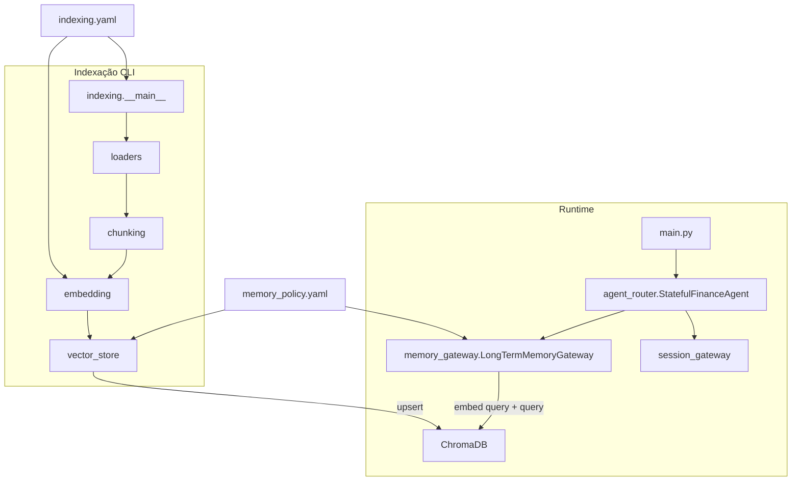

# Arquitetura do sistema (RAG e agente de negociação)

Documento de referência da arquitetura completa do agente com memória de curto e longo prazo (RAG). Use este arquivo junto com [state_rag.md](../../state_rag.md) como contexto entre blocos de implementação.

---

## 1. Visão geral

O sistema é um **agente de negociação de financiamento** que combina:

- **Memória de curto prazo**: sessão e checkpoint (estado da negociação: funnel_stage, proposed_rate, rejection_count) persistidos via Google ADK Session Service.
- **Memória de longo prazo (RAG)**: insights e políticas indexados em vector store (Chroma / Vertex / mock), recuperados por similaridade para enriquecer o prompt do LLM.

Fluxo principal: mensagem do usuário → recuperar sessão → montar system prompt (Jinja2) → buscar RAG (quando em `rate_proposed` ou `analyzing_credit`) → injetar contexto no prompt do usuário → chamar Gemini → atualizar estado (ex.: recusas) → persistir checkpoint.

---

## 2. Diagrama de componentes

- **main.py**: ponto de entrada (API ou CLI); instancia gateways e StatefulFinanceAgent.
- **agent_router**: orquestra sessão, RAG e LLM; aplica FSM (handoff após N recusas).
- **session_gateway**: recover_or_create, save_checkpoint (Short-Term Memory).
- **memory_gateway**: search_customer_insights (Long-Term Memory); backends chroma | vertex | mock.
- **indexing**: pipeline loaders → chunking → embedding → vector_store; config em indexing.yaml e memory_policy.yaml.

---

## 3. Fluxo RAG — Indexação

1. **Entrada**: arquivos CSV, JSON ou PDF (config: coluna/campo de texto em indexing.yaml).
2. **Loaders** ([src/indexing/loaders.py](../../src/indexing/loaders.py)): carregam documentos com `text` e `metadata` (source, session_id, tier, etc.).
3. **Chunking** ([src/indexing/chunking.py](../../src/indexing/chunking.py)): `chunk_text()` com estratégia `fixed` ou `by_paragraph`; tamanho e overlap em config.
4. **Embedding** ([src/indexing/embedding.py](../../src/indexing/embedding.py)): `embed_texts(..., for_query=False)` → Vertex com **RETRIEVAL_DOCUMENT** ou mock; um vetor por chunk.
5. **Vector store** ([src/indexing/vector_store.py](../../src/indexing/vector_store.py)): `upsert_documents(ids, vectors, metadatas)` → Chroma (persist), Vertex (stub) ou mock (JSONL).
6. **Config**: [config/indexing.yaml](../../config/indexing.yaml) (chunking, csv, json, pdf, embedding); [config/memory_policy.yaml](../../config/memory_policy.yaml) (vector_search.backend, chroma.*, mock.path).

---

## 4. Fluxo RAG — Consulta

1. **Origem**: Em [src/agent_router.py](../../src/agent_router.py), nas fases `rate_proposed` e `analyzing_credit`, o router monta uma **query enriquecida** (session_id + contexto da mensagem do cliente).
2. **Gateway**: `memory_gw.search_customer_insights(query=..., where_metadata=...)` (where opcional para filtrar por session_id ou outro campo).
3. **Embedding da query**: `embed_texts([query], for_query=True)` → Vertex com **RETRIEVAL_QUERY** (ou mock); garante melhor similaridade semântica na busca.
4. **Chroma**: `collection.query(query_embeddings=..., n_results=max_documents, where=where_metadata, include=["documents", "distances"])`.
5. **Pós-processamento (Chroma)**: converter distância cosine em similaridade com `similarity = max(0, 1 - distance)` (evita valor negativo; Chroma retorna distância em que menor = mais similar); filtrar documentos com `similarity >= min_similarity_score`; ordenar por similaridade decrescente; concatenar o texto dos documentos restantes.
6. **Injeção**: resultado é passado ao template [prompts/context_injector.jinja2](../../prompts/context_injector.jinja2) como `long_term_insights` e enviado ao LLM junto com a mensagem do usuário.

---

## 5. Decisões de desenho

- **Task type document vs query**: documentos indexados com RETRIEVAL_DOCUMENT; consultas com RETRIEVAL_QUERY para melhor relevância (Vertex AI).
- **min_similarity_score**: aplicado após a busca (apenas **Chroma**); documentos abaixo do threshold são descartados antes de concatenar. Fórmula: `similarity = max(0, 1 - distance)` para distância cosine.
- **where (metadados)**: opcional na busca (**Chroma**); quando o use case é “insights desta sessão”, filtrar por `session_id` reduz ruído.
- **Quando where retorna 0 resultados**: decisão de produto — retornar string vazia (agente segue sem RAG). Não há fallback automático (ex.: nova busca sem where).
- **Query enriquecida**: além de session_id, incluir contexto (ex.: trecho da mensagem do cliente) melhora a recuperação semântica.
- **Retry e degradação**: busca vetorial com tenacity; em falha após retries, retorna string vazia (agente segue sem RAG).

### Comportamento por backend

| Backend | min_similarity_score | where_metadata | Observação |
|---------|----------------------|----------------|------------|
| **Chroma** | Aplicado (pós-busca, filtro e ordenação) | Aplicado na query | Fórmula `max(0, 1 - distance)`. |
| **Vertex** | Não aplicado no cliente | Não enviado | Comportamento padrão do serviço (search_memory); score/where dependem da API do Vertex. |
| **Mock** | Não aplicado | Ignorado | Retorno fixo por substring na query; usado em testes e degradação. |

### Embedding: dimensão mock vs Vertex

O mock produz vetores de **768 dimensões** (mesma dimensão do Vertex com `text-multilingual-embedding-002`) para permitir alternar entre mock e Vertex sem reindexar o Chroma. Indexação e consulta devem usar o mesmo modelo (ou mock em ambos) para compatibilidade.

---

## 6. Configuração

| Arquivo | Seção / chave | Uso |
|---------|----------------|-----|
| config/memory_policy.yaml | vector_search.backend | chroma \| vertex \| mock |
| config/memory_policy.yaml | vector_search.max_documents | Limite de documentos na busca |
| config/memory_policy.yaml | vector_search.min_similarity_score | Filtro pós-busca (>=) |
| config/memory_policy.yaml | vector_search.chroma.* | persist_directory, collection_name |
| config/indexing.yaml | chunking.* | chunk_size_chars, overlap_chars, strategy |
| config/indexing.yaml | embedding.* | model, batch_size |

---

## 7. Testes

- **Unit**: chunking ([tests/test_indexing.py](../../tests/test_indexing.py)), loaders CSV/JSON, embedding mock (for_query True/False).
- **Gateway**: mock (query fixa); Chroma com config temporária — assert de aplicação de min_similarity e ordenação.
- **E2E**: indexar sample (ex.: data/sample_insights.csv) em Chroma temporário → buscar com query que inclua session_id do CSV e where_metadata → assert que o texto do insight correspondente aparece no resultado.
